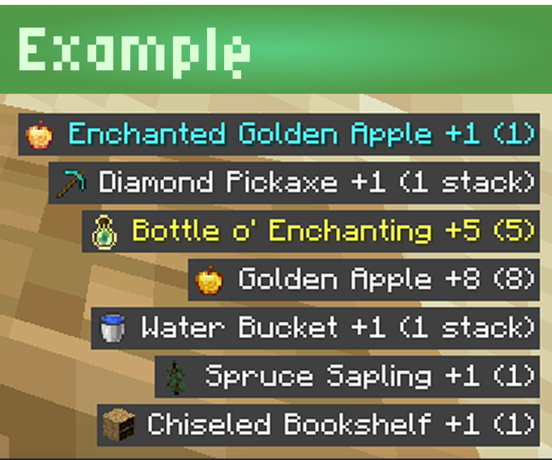
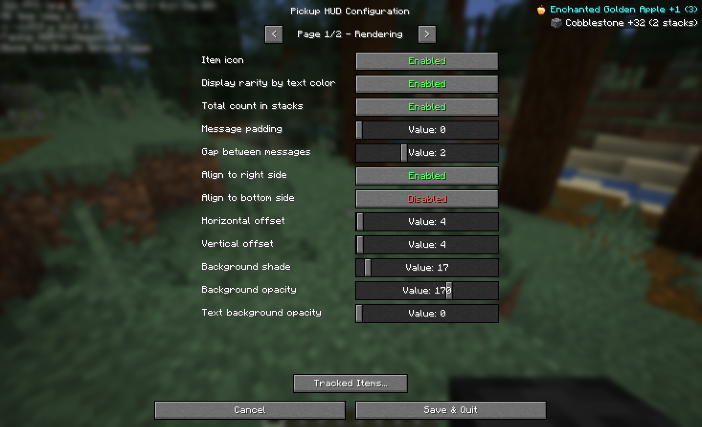
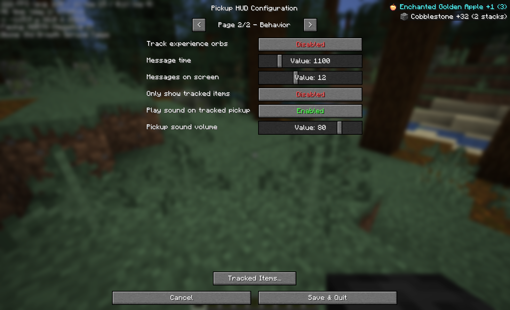
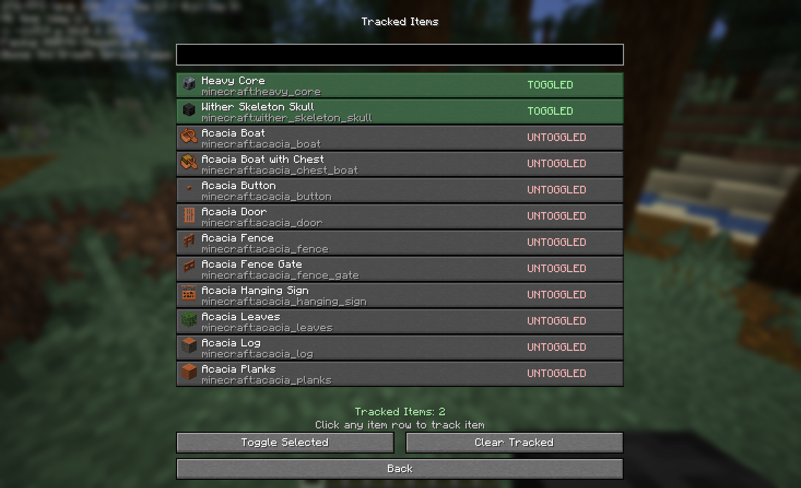

# Pickup HUD (Fabric, 1.21.x)

Client-side HUD notifications for picked-up items and experience, with tracked-item tools and configurable layout. Never miss what you collect!

## Compatibility

- Minecraft: `1.21.x` (`>=1.21 <1.22`)
- Fabric Loader: `0.18.4+`
- Java: `21+` recommended for runtime

## Features

- HUD messages for items and experience pickups.
- Tracked Items menu:
- Search by item name or ID.
- See item icon, display name, and full identifier.
- Track / Untrack / Toggle / Clear actions.
- Optional filtering:
  - Show only tracked items.
  - Play sound only when tracked items are picked up.
- Customizable HUD appearance:
  - Left/right and top/bottom alignment.
  - X/Y offsets.
  - Message/background opacity and shade.
  - Message count, duration, spacing, and icon display options.

  

## Installation

1. Install Fabric Loader for Minecraft `1.21.x`.
2. Install Fabric API.
3. Put `pickuphud-*.jar` in your instance `mods` folder.
4. Launch the game and configure through Mod Menu.

## Settings

  
  
  

## Suggestions & Support

Need a specific version support? Or maybe a new feature?
Send your issue request to [Github Issues](https://github.com/kotleni/expansion-minecraft/issues) or email me `yavarenikya@gmail.com`.